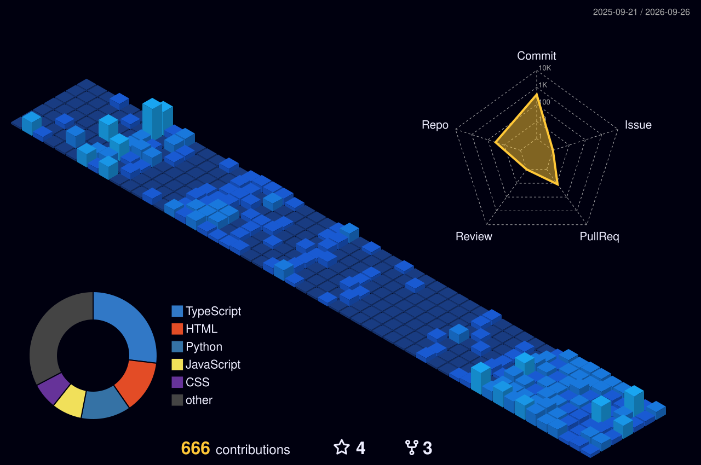

<h1 align="left">Hi 👋, I'm Deepak Raj JS </h1><h2 align="left">
An ECE student, freelancer, and <b> 💙 Open Source Contributor</b> who loves turning ideas into reality through web development and embedded systems. </h2>
 
### 🛠️ Tech Stack   
 

### Languages & Frameworks

      

### Tools & Platforms  
  
 

---
## 📈 Contribution Activity

###
<td width="50%" valign="top">

---

## 🖥️ GitHub Profile 3D Contrib

---

###

 
## 🏆 Certifications Gallery

<table>
  <tr>
    <td align="center" width="20%" valign="top">
      <a href="https://github.com/deepakrajjs-29/deepakrajjs-29/blob/main/certificate/AWS%20Certified%20Cloud%20Practitioner%20certificate.pdf">
         <b>Cloud Practitioner</b> AWS • PDF
      </a>
    </td>
    <td align="center" width="20%" valign="top">
      <a href="https://github.com/deepakrajjs-29/deepakrajjs-29/blob/main/certificate/AWS%20Certified%20Solutions%20Architect%20-%20Associate%20certificate%20(1).pdf">
         <b>Solutions Architect</b> AWS • PDF
      </a>
    </td>
    <td align="center" width="20%" valign="top">
      <a href="https://github.com/deepakrajjs-29/deepakrajjs-29/blob/main/certificate/AWS%20Gen%20AI%20.pdf">
         <b>Gen AI</b> AWS • PDF
      </a>
    </td>
    <td align="center" width="20%" valign="top">
      <a href="https://github.com/deepakrajjs-29/deepakrajjs-29/blob/main/certificate/AWS%20ML%20.pdf">
         <b>ML</b> AWS • PDF
      </a>
    </td>
    <td align="center" width="20%" valign="top">
      <a href="https://github.com/deepakrajjs-29/deepakrajjs-29/blob/main/certificate/Oracle%20Database%40AWS%20Certified%20Architect%20Professional.pdf">
         <b>Database@AWS Pro</b> Oracle • PDF
      </a>
    </td>
  </tr>
  <tr>
    <td align="center" width="20%" valign="top">
      <a href="https://github.com/deepakrajjs-29/deepakrajjs-29/blob/main/certificate/Azure%20AI%20fundamentals.pdf">
         <b>AI Fundamentals</b> Microsoft • PDF
      </a>
    </td>
    <td align="center" width="20%" valign="top">
      <a href="https://github.com/deepakrajjs-29/deepakrajjs-29/blob/main/certificate/azure%20data%20.PNG">
         <b>Azure Data</b> Microsoft • PNG
      </a>
    </td>
    <td align="center" width="20%" valign="top">
      <a href="https://github.com/deepakrajjs-29/deepakrajjs-29/blob/main/certificate/DP-600%20Microsoft%20Certified%20Fabric%20Analytics%20Engineer%20Associate.pdf">
         <b>DP-600 Fabric</b> Microsoft • PDF
      </a>
    </td>
    <td align="center" width="20%" valign="top">
      <a href="https://github.com/deepakrajjs-29/deepakrajjs-29/blob/main/certificate/DP-700%20%E2%80%93%20Microsoft%20Certified%20Fabric%20Data%20Engineer%20Associate.pdf">
         <b>DP-700 Fabric</b> Microsoft • PDF
      </a>
    </td>
    <td align="center" width="20%" valign="top">
      <a href="https://github.com/deepakrajjs-29/deepakrajjs-29/blob/main/certificate/DP-800.pdf">
         <b>DP-800</b> Microsoft • PDF
      </a>
    </td>
  </tr>
  <tr>
    <td align="center" width="20%" valign="top">
      <a href="https://github.com/deepakrajjs-29/deepakrajjs-29/blob/main/certificate/oci%20foundation.pdf">
         <b>OCI Foundation</b> Oracle • PDF
      </a>
    </td>
    <td align="center" width="20%" valign="top">
      <a href="https://github.com/deepakrajjs-29/deepakrajjs-29/blob/main/certificate/ai%20foundation.pdf">
         <b>AI Foundation</b> AI • PDF
      </a>
    </td>
    <td align="center" width="20%" valign="top">
      <a href="https://github.com/deepakrajjs-29/deepakrajjs-29/blob/main/certificate/data%20science%20professional.pdf">
         <b>Data Science Pro</b> Data • PDF
      </a>
    </td>
    <td align="center" width="20%" valign="top">
      <a href="https://github.com/deepakrajjs-29/deepakrajjs-29/blob/main/certificate/developer%20professional.pdf">
         <b>Developer Pro</b> Data • PDF
      </a>
    </td>
    <td align="center" width="20%" valign="top">
      <a href="https://github.com/deepakrajjs-29/deepakrajjs-29/blob/main/certificate/snowflake_Snowpro_associate_platform.pdf">
         <b>SnowPro Associate</b> Snowflake • PDF
      </a>
    </td>
  </tr>
  <tr>
    <td align="center" width="20%" valign="top">
      <a href="https://github.com/deepakrajjs-29/deepakrajjs-29/blob/main/certificate/Data%20bricks.pdf">
         <b>Databricks</b> Databricks • PDF
      </a>
    </td>
    <td align="center" width="20%" valign="top">
      <a href="https://github.com/deepakrajjs-29/deepakrajjs-29/blob/main/certificate/Sales%20force.pdf">
         <b>Salesforce</b> Salesforce • PDF
      </a>
    </td>
    <td align="center" width="20%" valign="top">
      <a href="https://github.com/deepakrajjs-29/deepakrajjs-29/blob/main/certificate/Certificate%20-%20ServiceNow.pdf">
         <b>ServiceNow</b> ServiceNow • PDF
      </a>
    </td>
    <td align="center" width="20%" valign="top">
      <a href="https://github.com/deepakrajjs-29/deepakrajjs-29/blob/main/certificate/Micro-Certification%20-%20Welcome%20to%20ServiceNow.pdf">
         <b>Welcome Micro-Cert</b> ServiceNow • PDF
      </a>
    </td>
    <td align="center" width="20%" valign="top">
      <a href="https://github.com/deepakrajjs-29/deepakrajjs-29/blob/main/certificate/RED%20HAT.jpg">
         <b>Red Hat</b> Red Hat • JPG
      </a>
    </td>
  </tr>
</table>

<i>Click any card to open full certificate</i>

## 📫 Let's Connect

<table>
<tr>
<td align="center" width="25%">

 
Professional Network
</td>
<td align="center" width="25%">

 
Daily Updates
</td>
<td align="center" width="25%">

 
Business Inquiries
</td>
<td align="center" width="25%">

 
Open Source
</td>
</tr>
</table>

---

### 💡 *"Code is like humor. When you have to explain it, it's bad."*

  <picture>
    <source media="(prefers-color-scheme: dark)" srcset="https://raw.githubusercontent.com/deepakrajjs-29/deepakrajjs-29/output/pacman-contribution-graph-dark.svg">
    <source media="(prefers-color-scheme: light)" srcset="https://raw.githubusercontent.com/deepakrajjs-29/deepakrajjs-29/output/pacman-contribution-graph.svg">
    
  </picture>

⭐️ From [deepakrajjs-29](https://github.com/deepakrajjs-29) with 💙
